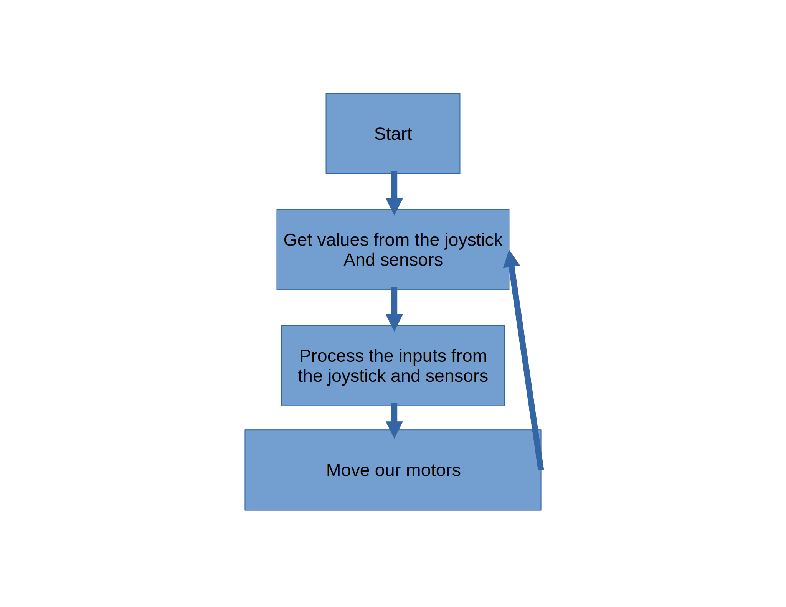

# Anatomy of a Basic Robot Program

We will begin by talking within the context of a VEX robot since it is much more simple than our FRC code. The code that you see below is a fully working program for the ProtoBot VEX robots that you will build early during your time on Team 100.

## The Concept

As you read through the code, remember the diagram below: 


This diagram explains the high level of what we do when running the ProtoBot code. When we start, our robot begins by *sensing* its current state from the sensors and joysticks. It then *interprets* the sensors to define our *actions* which are the motors moving.

In the code, you will see how interpretation can exist beyond simply taking joystick inputs as we use our limit switches to see if it is safe to move our arm. In this snippet, you can see how we make a decision based on:

1. What the driver **wants** to do and
2. Whether it is safe to move the action

> Lines that start with // are comments and are used to explain, but have no impact on how the robot actually works.


```c
// Does the driver want to move up and is it safe to do so?
if((leftButtonUp == 1) && (armUpLimitSwitch == 0))
{
    // If so, move up
    motor[Arm] = 127;
}
// Otherwise, does the driver want to move down and is it safe to do so?
else if ((leftButtonDown == 1) && (armDownLimitSwitch == 0))
{
    // If so, move down
    motor[Arm] = -127;
}
// Otherwise, the driver either does not want to move or wants to make an unsafe movement
else
{
    // In which case we will not allow the arm to move.
    motor[Arm] = 0;  // if you don't set the motors to 0, they will keep running forever
}
```
## The Code

```c
////////////////////////////////////////////////////////////////////
// Protobot.c                                                     //
////////////////////////////////////////////////////////////////////
//                                                                //
// This code is the end code for a fully functional VEX protobot. //
//                                                                //
// It demonstrates many of the basic concepts of a robot program. //
////////////////////////////////////////////////////////////////////


///////////////////////////////////////////////////////////////////////////////////////////////
// Configuring Your Robot                                                                    //
///////////////////////////////////////////////////////////////////////////////////////////////
// In RobotC, lines that start with #pragma tell RobotC how your robot is set up.            //
//                                                                                           //
// It has information about where motors are sensors are plugged in, as well as their names. //
///////////////////////////////////////////////////////////////////////////////////////////////
#pragma config(Motor,  port2,           RightDrive,    tmotorServoContinuousRotation, openLoop)
#pragma config(Motor,  port4,           LeftDrive,     tmotorServoContinuousRotation, openLoop)
#pragma config(Motor,  port5,           IntakeWheel,   tmotorServoContinuousRotation, openLoop)
#pragma config(Motor,  port7,           Arm,           tmotorServoContinuousRotation, openLoop)
#pragma config(Sensor, dgtl5,  					ArmUp,         sensorTouch)
#pragma config(Sensor, dgtl6,  					ArmDown,       sensorTouch)

/////////////////////////////////////////////////////////////////////////////////////////////////
// task main()                                                                                 //
/////////////////////////////////////////////////////////////////////////////////////////////////
// When you start running your code, your robot will need to know where to start reading from. //
//                                                                                             //
// In VEX, wherever you see task main is the place where                                       //
// the code starts reading from                                                                //
/////////////////////////////////////////////////////////////////////////////////////////////////
task main()
{
    //////////////////////////////////////////////////////////////////////////////
    // Variables                                                                //
    //////////////////////////////////////////////////////////////////////////////
    // Variable keep track of information. They act like a bucket.              //
    //                                                                          //
    // The word int means that the information in the bucket is a whole number. //
    //                                                                          //
    // For JoystickValues, the values range from -127 to 127.                   //
    // For Buttons and LimitSwitches, the value is either 0 or 1.               //
    //////////////////////////////////////////////////////////////////////////////
    int rightJoystickValue = 0;
    int leftJoystickValue = 0;
    int leftButtonUp = 0;
    int leftButtonDown = 0;
    int rightButtonUp = 0;
    int rightButtonDown = 0;
    int armUpLimitSwitch = 0;
    int armDownLimitSwitch = 0;

    //////////////////////////////////////////////////////////////////////////////////////////////////
    // This code here means that your program will run forever.                                     //
    //                                                                                              //
    // Just like when you read an instruction manual, you start at the beginning and go to the end. //
    // However, if you aren't specifically told to repeat something, you wouldn't know to do so.    //
    // By telling our robot to repeat, it will run our code forever.                                //
    //////////////////////////////////////////////////////////////////////////////////////////////////
    while(1==1)
    {
        ///////////////////////////////////////////////////////////////////////////////////
        // Get joystick and sensor values                                                //
        ///////////////////////////////////////////////////////////////////////////////////
        // This code gets values from the joystick and puts those values into variables. //
        // Once the values are in a variable, we can easily process them.                //
        //                                                                               //
        // The vexRT word tells our robot to look at the joystick.                       //
        // Calls to SensorValue tell our robot to look at the value from an sensor.      //
        ///////////////////////////////////////////////////////////////////////////////////
        rightJoystickValue = vexRT[Ch2];
        leftJoystickValue = vexRT[Ch3];
        leftButtonUp = vexRT[Btn5U];
        leftButtonDown = vexRT[Btn5D];
        rightButtonUp = vexRT[Btn6U];
        rightButtonDown = vexRT[Btn6D];

        armUpLimitSwitch = SensorValue[ArmUp];
        armDownLimitSwitch = SensorValue[ArmDown];


        ////////////////////////////////////////////////////////////////////
        // Interpret and Act                                              //
        ////////////////////////////////////////////////////////////////////
        // This big block of code tells our robot to process our inputs   //
        // (sensors and joystick values) and identify an output (motors). //
        //                                                                //
        // The if statements work to identify the driver's intention.     //
        // Does the driver want to move the arm up? Is it safe to move    //
        // the arm up? All of that is evaluated within the parentheses    //
        // next to the word if.                                           //
        //                                                                //
        // The calls, such as motor[Arm] = 127; tell the robot to move    //
        // a motor at a certain power, ranging from -127 to 127.          //
        //                                                                //
        // Else acts as an aditional way to program logic, where the      //
        // robot will look and see if that logic is valid if and only     //
        // if the if statement above it was not true.                     //
        ////////////////////////////////////////////////////////////////////
        motor[RightDrive] = rightJoystickValue;
        motor[LeftDrive] = leftJoystickValue * -1;

        if((leftButtonUp == 1) && (armUpLimitSwitch == 0))
        {
            motor[Arm] = 127;
        }
        else if ((leftButtonDown == 1) && (armDownLimitSwitch == 0))
        {
            motor[Arm] = -127;
        }
        else
        {
            motor[Arm] = 0;  // if you don't set the motors to 0, they will keep running forever
        }

        if(rightButtonUp == 1)
        {
            motor[IntakeWheel] = 127;
        }
        else if (rightButtonDown == 1)
        {
            motor[IntakeWheel] = -127;
        }
        else
        {
            motor[IntakeWheel] = 0;
        }
    }
  }
```
## The Code Explained
### Configuration
By default, your robot will not know what is plugged into what port on your VEX Cortex. At the very top of the code, we can tell our robot what is plugged into where. This has a couple of benefits:

- Creates a source of truth for what is plugged into where into our program
- Allows us to refer to motors and sensors by names (e.g. `IntakeWheel`) rather than ports
- Makes it easy to update the code when there is a change to ports, since a device like `IntakeWheel` can just be reassigned to a new port, rather than having to replace all uses in the code

The configuration lines are not written by hand, but rather configured through the RobotC Robot Configuration window.

### task main()
When your robot reads your code, it needs to know where to start. Imagine how it difficult it would be for you to assemble a bed if there was no starting point! When you turn your Cortex on, it knows to look for something called `task main()` as the starting point for your code.

Since our robot knows to look to this location as the starting point, we put our entire robot code inside of this task.

### Variables

Variables are like a bucket that can store information. We put our sensor and joystick values into buckets so that we can then use their values to *interpret* intent.

Variables have a specific *type* associated to them. A type is a specific format of information. Think of it like a calculator. It wouldn't make sense to put a photograph in to your calculator. So, your calculator expects your numbers in a specific format, usually decimals. Programs usually store numbers, true/false, and text. The types that are common in RobotC are:

| Name   | Type       | Min     | Max    | Example Values |
|--------|------------|---------|--------|----------------|
| int    | Integer    | -32,767 | 32,767 | -1, 15         |
| bool   | True/False |         |        | true, false    |
| string | Text       |         |        | "abc"          |
| float  | Decimal    | Varies  | Varies | 0.123          |
| char   | Integer    | -127    | 127    | 'A', 1         |

Our code exclusively uses int and bool. When we use [conditionals](#conditionals), we use bools even if we don't define them.

#### One Value

> Variables must always have one and only one value

This is one of the most important concepts in programming. Let's take a look at what this means with one of the lines in our program:

```c
int rightJoystickValue = 0;
```

Though this line seems simple, it is really powerful. With one line, we can tell our robot to:
- Create a new variable/bucket of type `int`
- Assign the name `rightJoystickValue` to that new variable
- Set `rightJoystickValue`'s value to `0`.

Now, when we use `rightJoystickValue` in our code, it returns `0`. However, `rightJoystickValue` does not always have to be `0`. Shortly after in the code, we call

```c
rightJoystickValue = vexRT[Ch2];
```
This line, once again, does many things with very little code. You will notice that `int` is missing, since we don't want to create a new variable, we want to override the value of `rightJoystickValue`.

This line:
- Asks the joystick for the value of Channel 2
- Finds the variable called `rightJoystickValue`
- Copies the value from Channel 2 to the bucket called `rightJoystickValue`

### Conditionals

## Sources
- [https://gitlab.com/-/snippets/2042879](https://gitlab.com/-/snippets/2042879)
- [https://www.ddtwo.org/site/handlers/filedownload.ashx?moduleinstanceid=28565&dataid=40000&FileName=RobotC%20Programming%20Guide.pdf](https://www.ddtwo.org/site/handlers/filedownload.ashx?moduleinstanceid=28565&dataid=40000&FileName=RobotC%20Programming%20Guide.pdf)
- [https://en.wikipedia.org/wiki/C_data_types](https://en.wikipedia.org/wiki/C_data_types)