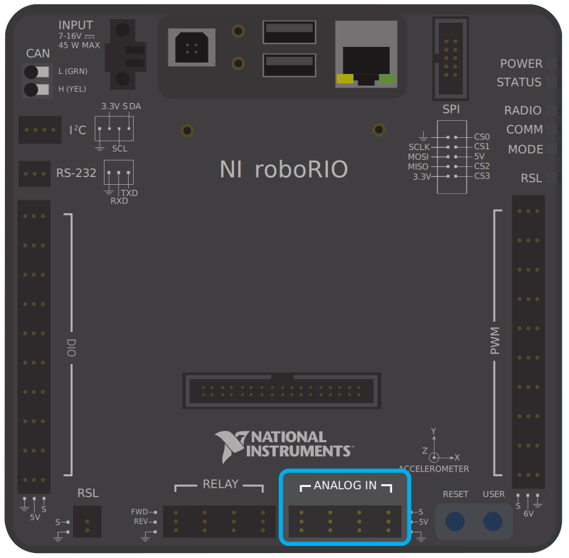

# Sensors

Sensors allow our robot to get an understanding of itself and its surroundings. Some examples of what we would do with sensors include:

- Find the angle of an arm
- Find the position of an elevator
- Detect if a game object has passed a certain area in our robot
- Detect how far away we are from a game object

They tend to be separated into three groups: analog, digital, and other.

## Types of Sensors
### Analog

Analog sensors measure on a gradient (has intermediate values). They are often used for measuring physical attributes, such as the angle of a mechanism.

Here is a graph showing sample Analog (red) and Digital (blue) values over time

#### Port Locations
On a RoboRIO (FRC), Analog Inputs are connected to the following ports:

[SOURCE](https://docs.wpilib.org/en/stable/docs/hardware/sensors/analog-inputs-hardware.html)

### Digital

Digital sensors measure with values of 0 (`false`) or 1 (`true`). They are usually used to detect if something is present (such as through touch), though some sensors measuring distance may be considered digital.

#### Port Locations
On a RoboRIO (FRC), Digital Inputs are connected to the following ports:

[SOURCE](https://docs.wpilib.org/en/stable/docs/hardware/sensors/digital-inputs-hardware.html)

### Other

Some sensors, such as cameras, LiDAR, IMU (measuring pitch, yaw, and roll), and encoders (measure the distance a mechanism has moved) are technically digital, but their raw signal cannot be used without adding extra logic to interpret what the signals mean.

### Examples of Sensors

This is only intended to be a beginning look at sensors. Look at [docs.wpilib.org](https://docs.wpilib.org) for more info on sensors used in FRC. As you can see, most of the sensors we use are digital.

| Name                            | Type        | Measures                                | Notes                              |
|---------------------------------|-------------|-----------------------------------------|------------------------------------|
| Limit Switch                    | Digital     | Whether the switch is pushed            |                                    |
| Hall Effect                     | Digital     | Whether a magnet is close to the reader |                                    |
| Time of Flight                  | Other (I2C) | Distance to an object                   |                                    |
| Encoder (Quadrature)            | Digital     | How far a motor has turned              | Requires 2 DIO Ports               |
| Inertial Measurement Unit (IMU) | Other (I2C) | The pitch, yaw, and roll of the robot   | Place near the center of the robot |
| Ultrasonic Range Finder         | Analog      | Distance to an object                   |                                    |

## Sensors in VEX Code